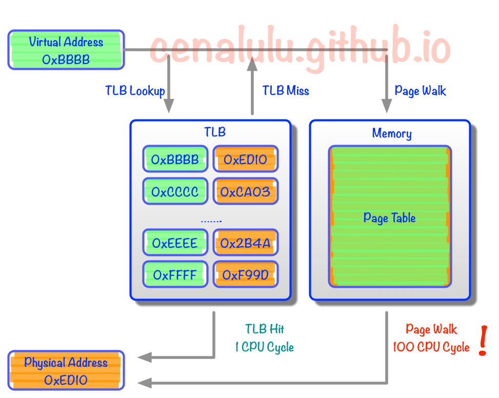
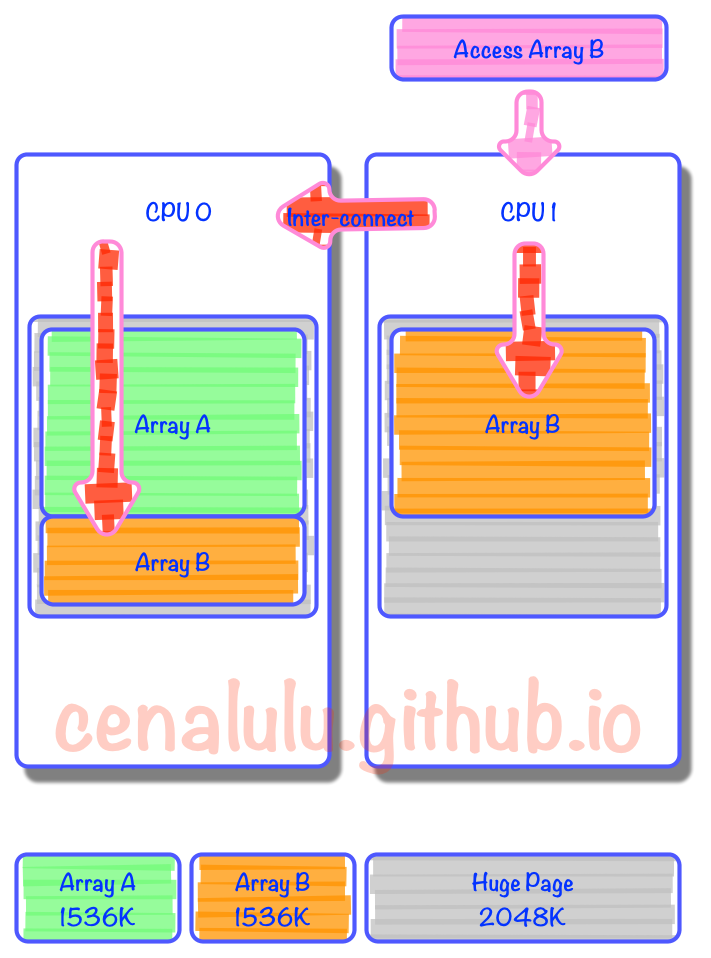

# 关于 Huge Page

### 为什么需要 Huge Page
* 了解 CPU Cache 大致架构的话，一定听过 TLB Cache
    * 随着计算需求规模的不断增大，应用程序对内存的需求也越来越大。为了实现虚拟内存管理机制，操作系统对内存实行分页管理。
    * 自内存“分页机制”提出之始，内存页面的默认大小便被设置为 4096 字节（4KB）。 4KB 大小的页面在“分页机制”提出的时候是合理的，因为当时的内存大小不过几十兆字节。
    * 对应用程序可见的、并可使用的内存地址是 Virtual Address。每个程序的内存地址都是从 0 开始的；而实际的数据访问是要通过 Physical Address 进行的。
    * 因此，每次内存操作，CPU 都需要从 page table 中把 Virtual Address 翻译成对应的 Physical Address。那么对于大量内存密集型程序来说 page table 的检索就会成为程序的瓶颈。
    * 所以现代 CPU 中就出现了 TLB(Translation Lookaside Buffer) Cache 用于缓存少量热点内存地址的 mapping 关系。（关键点！！！）
    * 另外，在 Linux 操作系统上运行内存需求量较大的应用程序时，如果其采用的默认页面大小为 4KB，可能会产生较多 TLB Miss 和缺页中断，从而大大影响应用程序的性能。
* 然而由于制造成本和工艺的限制
    * 响应时间可以控制在 CPU Cycle 级别的 Cache 容量只能存储几十个对象。
    * 那么 TLB Cache 在应对大量热点数据 Virual Address 转换的时候就显得捉襟见肘了。
    * 我们来算下按照标准的 Linux 页大小 (page size) 4K，一个能缓存 64 元素的 TLB Cache 只能涵盖 4K*64 = 256K 的热点数据的内存地址。
* 于是 Huge Page 就产生了
    * 这里不要把 Virutal Address 和 Windows 上的虚拟内存搞混了。后者是为了应对物理内存不足，而将内容从内存换出到其他设备的技术（类似于 Linux 的 SWAP 机制）。


### 什么是 Huge Page
* 既然改变不了 TLB Cache 的容量
    * 那么只能从系统层面增加一个 TLB Cache entry 所能对应的物理内存大小，从而增加 TLB Cache 所能涵盖的热点内存数据量。
    * 假设我们把 Linux Page Size 增加到 16M，那么同样一个容纳 64 个元素的 TLB Cache 就能顾及 64*16M = 1G 的内存热点数据，这样的大小相较上文的 256K 就显得非常适合实际应用了。
    * 像这种将 Page Size 加大的技术就是 Huge Page。
    
### Huge Page 是万能的吗
* 了解了 Huge Page 的由来和原理后，我们不难总结出
    * 能从 Huge Page 受益的程序必然是那些热点数据分散且至少超过 64 个 4K Page Size 的程序。
    * 此外，如果程序的主要运行时间并不是消耗在 TLB Cache Miss 后的 Page Table Lookup 上，那么 TLB 再怎么大，Page Size 再怎么增加都是徒劳。
* 在目前常见的 NUMA 体系下 Huge Page 也并非万能钥匙，使用不当甚至会使得程序或者数据库性能下降 10%
    * 性能下降的原因主要有以下两点
        * CPU 对同一个 Page 抢占增多。对于写操作密集型的应用，Huge Page 会大大增加 Cache 写冲突的发生概率。由于 CPU 独立 Cache 部分的写一致性用的是 MESI 协议。也会导致：CPU 本地 Cache 频繁失效。
        * 类比到数据库就相当于，原来一把用来保护 10 行数据的锁，现在用来锁 1000 行数据了。必然这把锁在线程之间的争抢概率要大大增加。
    * 连续数据需要跨 CPU 读取(False Sharing）
        * 从下图我们可以看到，原本在 4K 小页上可以连续分配，并因为较高命中率而在同一个 CPU 上实现 locality 的数据。
        * 到了 Huge Page 的情况下，就有一部分数据为了填充统一程序中上次内存分配留下的空间，而被迫分布在了两个页上。
        * 而在所在 Huge Page 中占比较小的那部分数据，由于在计算 CPU 亲和力的时候权重小，自然就被附着到了其他 CPU 上。
        * 那么就会造成：本该以热点形式存在于 CPU2 L1 或者 L2 Cache 上的数据，不得不通过 CPU inter-connect 去 remote CPU 获取数据。
        * 假设我们连续申明两个数组，Array A 和 Array B 大小都是 1536K。内存分配时由于第一个 Page 的 2M 没有用满，因此 Array B 就被拆成了两份，分割在了两个 Page 里。而由于内存的亲和配置，一个分配在 Zone 0，而另一个在 Zone 1。那么当某个线程需要访问 Array B 时就不得不通过代价较大的 Inter-Connect 去获取另外一部分数据。
        * 

### Huge Page 使用（三种方式）
* 使用 mmap + MAP_HUGETLB 直接匿名映射
* 使用 shmget + SHM_HUGETLB 属性分配
* mount hugetlbfs 后，在 hugetlbfs 下创建文件，然后通过 mmap 进行映射
    * 将 hugetlbfs 特殊文件系统挂载到根文件系统的某个目录上去，以使得 hugetlbfs 可以访问。
    * $ mount none /mnt/huge -t hugetlbfs
    * 此后，只要是在 /mnt/huge/ 目录下创建的文件，将其映射到内存中时都会使用 2MB 作为分页的基本单位。
    * 值得一提的是，hugetlbfs 中的文件是不支持读/写系统调用 ( 如 read()/write() 等 ) 的，一般对它的访问都是以内存映射(mmap)的形式进行的。
* 注:上述方法使用的前提是，系统中加载了 hugetlbfs，且存在空闲大页。可以通过 cat /proc/meminfo 查看是否有空闲内存。
* 另外，本质上匿名大页也是有对应的大页文件系统中的匿名文件，其实并不是真正的匿名页。
* 应用示例：
```
## 下面例子中给出的大页面应用是简单的，而且如果仅仅是这样的应用，对应用程序来说也是没有任何用处的。
## 在实际应用中，为了使用大页面，还需要将应用程序与库 libhugetlb 链接在一起。
## libhugetlb 库对 malloc()/free() 等常用的内存相关的库函数进行了重载，以使得应用程序的数据可以放置在采用大页面的内存区域中，以提高内存性能。

#include <fcntl.h> 
#include <sys/mman.h> 
#include <errno.h> 

#define MAP_LENGTH      (10*1024*1024) 

int main() 
{
    int fd; 
    void * addr; 
    
    /* create a file in hugetlb fs */ 
    fd = open("/mnt/huge/test", O_CREAT | O_RDWR); 
    if(fd < 0){ 
        perror("Err: "); 
        return -1; 
    }   
    
    /* map the file into address space of current application process */ 
    addr = mmap(0, MAP_LENGTH, PROT_READ | PROT_WRITE, MAP_SHARED, fd, 0); 
    if(addr == MAP_FAILED){ 
        perror("Err: "); 
        close(fd); 
        unlink("/mnt/huge/test"); 
        return -1; 
    }   
    
    /* from now on, you can store application data on huage pages via addr */ 
    
    munmap(addr, MAP_LENGTH); 
    close(fd); 
    unlink("/mnt/huge/test"); 
    return 0; 
}
```
* 对于系统中大页面的统计信息可以在 Proc 特殊文件系统（/proc）中查到
    * $ cat /proc/sys/vm/nr_hugepages
    * $ echo 512 > /proc/sys/vm/nr_hugepages  # 调整系统中的大页面的数目为 512
        * $ sysctl -w vm.nr_hugepages=512
    * 以上都是临时设置，若需永久生效，则可修改文件 /etc/sysctl.conf
        * 修改后使用 sysctl -p 命令重加载内核参数文件 sysctl.conf
    * cat /proc/meminfo | grep Huge  # 查看系统 huge page 设置

### 什么是透明大页
* 对于内存占用较大的程序，可以通过开启 HugePage 来提升系统性能。但有个要求，就是在编写程序时，代码里需要显示的对 HugePage 进行支持。
* 而红帽企业版 Linux 为了减少程序开发的复杂性，并对 HugePage 进行支持，部署了 Transparent HugePages。
    * Transparent HugePages 是一个使管理 Huge Pages 自动化的抽象层
    * 实现方案为，操作系统后台有一个叫做 khugepaged 的进程，它会一直扫描所有进程占用的内存，在可能的情况下会把 4k Page 交换为 Huge Pages。

### 为什么 Transparent HugePages（透明大页）对系统的性能会产生影响
* 在 khugepaged 进行扫描进程占用内存，并将 4k Page 交换为 Huge Pages 的这个过程中，对于操作的内存的各种分配活动都需要各种内存锁，直接影响程序的内存访问性能。
* 并且，这个过程对于应用是透明的，在应用层面不可控制, 对于专门为 4k page 优化的程序来说，可能会造成随机的性能下降现象。

### 怎么关闭 Transparent HugePages（透明大页）
* 查看是否启用
    * $ cat  /sys/kernel/mm/transparent_hugepage/enabled 
    * [always] madvise never # 结果为 [always] 表示透明大页启用了，[never] 表示透明大页禁用
* 关闭
    * $ echo never > /sys/kernel/mm/transparent_hugepage/enabled
    * $ echo never > /sys/kernel/mm/transparent_hugepage/defrag
* 启用
    * $ echo always >  /sys/kernel/mm/transparent_hugepage/enabled 
    * $ echo always > /sys/kernel/mm/transparent_hugepage/defrag
* 设置开机关闭
    * 修改 /etc/rc.local 文件，添加如下行
```
if test -f /sys/kernel/mm/redhat_transparent_hugepage/enabled; then     
    echo never > /sys/kernel/mm/transparent_hugepage/enabled     
    echo never > /sys/kernel/mm/transparent_hugepage/defrag 
fi
```

### PHP7 中应用
* sysctl -w vm.nr_hugepages=512 # 分配 512*2M 的 HugePage 预留大页空间
* 编辑 php.ini
    * zend_extension=opcache.so
    * opcache.enable=1
    * opcache.enable_cli=1
    * opcache.huge_code_pages=1
* PHP7 开启 HugePage 支持后，会把自身的 text 段, 以及内存分配中的 huge 都采用大内存页来保存, 减少 TLB miss, 从而提高性能。
* 另外，很多软件官方文档里非常明确的提出了可以通过关闭 Transparent HugePages（透明大页）来解决系统负载过高的问题。


### 引用
* https://www.ibm.com/developerworks/cn/linux/l-cn-hugetlb/index.html
* https://segmentfault.com/a/1190000010436559
* http://www.laruence.com/2015/10/02/3069.html
* https://www.infoq.cn/article/practice-of-PHP7-upgrade-for-the-PC-master-station
