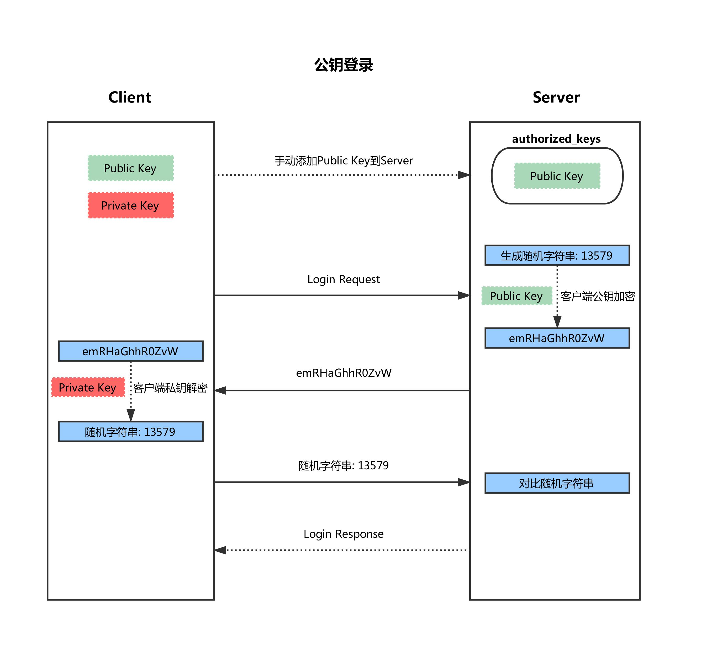

# SSH 说明文档

## 简介
* SSH（Secure Shell）是一套协议标准，可以用来实现两台机器之间的安全~登录~以及安全的~数据传送~，其保证数据安全的原理是非对称加密。

* 传统的对称加密使用的是一套秘钥，数据的加密以及解密用的都是这一套秘钥，可想而知所有的客户端以及服务端都需要保存这套秘钥，泄露的风险很高，而一旦秘钥便泄露便保证不了数据安全。

* 非对称加密解决的就是这个问题，它包含两套秘钥：公钥以及私钥。其中公钥用来加密，私钥用来解密，并且通过公钥计算不出私钥，因此私钥谨慎保存在服务端，而公钥可以随便传递，即使泄露也无风险。（流程是单向：公钥加密，私钥解密）。

* 保证 SSH 安全性的方法，简单来说就是客户端和服务端~各自生成~一套私钥和公钥，并且互相~交换公钥~，这样每一条发出的数据都可以用对方的公钥来加密，对方收到后再用自己的私钥来解密。

## 创建连接，并交换公钥（握手协议）

1. 客户端发起链接请求。
2. 服务端生成密钥对，并返回自己公钥、以及一个会话ID（这一步~客户端得到服务端公钥~）。
3. 客户端生成密钥对，并用自己的公钥~异或~会话ID，计算出一个值，在用服务端的公钥加密。
4. 客户端发送加密后的值到服务端，服务端用私钥解密。
5. 服务端用解密后的值~异或~会话ID，计算出客户端的公钥（这一步~服务端得到客户端公钥~）。

* 至此，双方各自持有三个秘钥：分别为自己的一对公、私钥，以及对方的公钥，之后的所有通讯都会被加密。
	> 这里有一个有趣的地方，两台机器第一次使用 SSH 链接时，当服务端返回自己的公钥（第2步）的时候，客户端会有一条信息提示：大意是无法验证对方是否可信，并给出对方公钥的MD5编码值，问是否确定要建立链接。
		> 这是因为 SSH 虽然传输过程中很安全，但是在首次建立链接时并没有办法知道发来的公钥是否真的来自自己请求的服务器，如果有人在客户端请求服务器后拦截了请求，并返回自己的公钥冒充服务器，这时候如果链接建立，那么所有的数据就都能被攻击者用自己的私钥解密了。这也就是所谓的中间人攻击。

## SSH 登录请求
 * SSH 账号密码登录
	* 
		* 服务端收到登录请求后，首先互换公钥，详细步骤如上一节所述。
		* 客户端用服务端的公钥加密账号、密码并发送。
		* 服务端用自己的秘钥解密后得到账号、密码，然后进行验证。
		* 服务端用客户端的公钥加密验证结果并返回。
		* 客户端用自己的秘钥解密后得到验证结果。

 * SSH 公钥登录
 	> 方便客户端程序连接到服务器，这时候用密码登录就比较不方便，一是需要处理输入密码的问题；二是需要想办法安全的储存密码到程序里，这种情况下便可以利用公钥来进行无密码登录。
 	* 
		* 客户端用户必须~手动地将自己的公钥添加到服务器~上一个名叫~authorized_keys~的文件里。顾名思义，这个文件保存了所有可以远程登录的机器的公钥。
			* 客户端发起登录请求（ssh 用户名@服务端主机名或者IP），并且发送一个自己~公钥指纹~（具有唯一性，但不是公钥）。
			* 服务端根据~公钥指纹~检测公钥是否保存在 authorized_keys 中。
			* 若存在，服务端便生成一段~随机字符串~，然后利用~客户端公钥（客户端先前上报的）~加密并返回。
			* 客户端收到后用自己的私钥解密，再利用~服务端公钥~加密后发回。
			* 服务端收到后用自己的私钥解密，如果为同一字符串，则验证通过。

