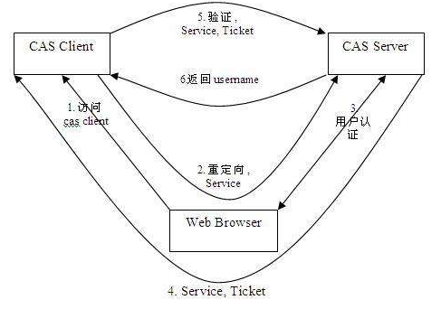

# SSO
所谓单点登录，简单说就是同平台的诸多应用登陆一次，下一次就免登陆的功能。其中 CAS 是目前较为流行的开源方案之一。

# 结构
* CAS Server：负责完成对用户的认证工作 , 需要独立部署 , CAS Server 会处理用户名/密码等凭证。
* CAS Client：负责处理对客户端受保护资源的访问请求，需要对请求方进行身份认证时，重定向到 CAS Server 进行认证。原则上，客户端应用不再接受任何的用户名密码等 Credentials。
> CAS Client 与受保护的客户端应用部署在一起，以 Filter 方式保护受保护的资源。

# 术语
* Ticket Granting ticket(TGT) ：可以认为是 CAS Server 根据用户名密码生成的一张票，存储在 server 端。
* Ticket-granting cookie(TGC) ：其实就是一个 cookie（注：域为 CAS Server），存放用户身份信息，由 server 发给 client 端。
* Service ticket(ST) ：由 TGT 生成的一次性票据，用于验证，只能用一次。相当于 server 发给 client 一张票，然后 client 拿着这是个票再来找 server 验证，看看是不是 server 签发的。

# 流程

1. 用户访问应用系统1，无 session 并且无票据 ST，会被 302 重定向到 CAS Server。又因为没有 TGC，所以会被再次 302 重定向到 CAS Server 的登录页面，并且 URL 带有应用系统1地址。
	* 形如：http://cas-server:8100/login?service=http://localhost:8081
	* service 后面这个地址就是登录成功后要重定向的应用系统1地址

2. 在登陆页面输入用户名密码进行认证，认证成功后 cas-server 生成 TGC cookie，写入浏览器。同时生成 TGT，再根据 TGT 发放票据 ST，并且重定向回应用系统1（附带刚才产生的 ST）。
	* 关键：浏览器种下 TGC；并将 ST 返回给应用系统1
	* 技巧：此时页面可以给出提示：登陆成功，正在跳转...
	
3. 浏览器带着 ST 再访问应用系统1
	* http://localhost:8081/?ticket=ST-25939-sqbDVZcuSvrvBC6MQlg5
	* ticket 后面那一串就是 ST

4. 应用系统1去 cas-server 验证一下该 ST 是否有效，验证通过后，写入 session 完成应用系统1的登陆过程。
	* 注：收到 ST 后，为什么还要验证呢？
		* 因为 CAS 知道这个用户已经登录过了，但是对于这个应用系统来说，并不知道这个用户已经登录过了，故需要验证。

5. 用户访问应用系统2，无 session 并且无票据 ST，再次被 302 重定向到 CAS Server，CAS Server 会主动获到 TGC cookie ，然后做下面的事情：
	* 如果持有的 TGC 还没失效，CAS Server 仅需重新生成一个 ST，并重定向到应用系统2即可。如同步骤 3
	* 如果 TGC 失效，那么用户需重新登陆认证。
