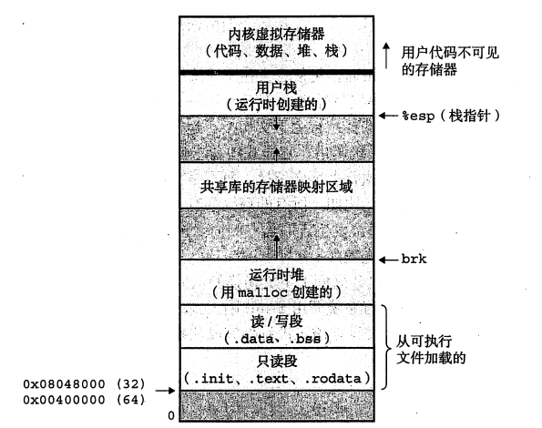
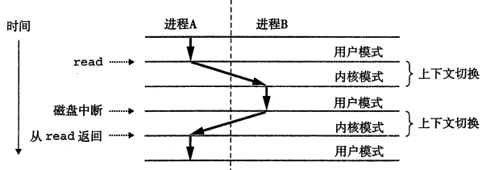

# 进程和协程切换原理及实现

# 推荐语
文章非常长，但请不要轻易的就此错过一篇诚心之作。敝人花了一个多周时间整理写作。不嫌麻烦的话，点个赞吧。
	
通过阅读本文，你将会学习到什么是进程？现代系统的多任务底层实现基础是什么？什么是内核模式、用户模式？什么是上下文切换？以及详细描述协程是什么、使用场景？协程调度器实现方式有哪些？协程栈实现方式有哪些？以及文章最后贴了一个协程库实现源码，放在敝人的GitHub上。

# 背景
在I/O多路复用成为服务端的事实上的通用开发模型之后，服务端的开发通常都是以异步回调模式来设计的。即一个业务流程中每一个阻塞I/O的节点，都需要进行切断业务处理流程、保存当前处理的上下文（用户上下文）、设置回调函数，然后等待I/O完成后，再恢复上下文、继续处理业务流程。
	
试想一下，在一个典型的互联网业务处理流程中，这样的行为节点，有时候可能多达几十个（微服务间的RPC请求、与REDIS之类的高速缓存的交互、与MYSQL之类的DB交互、调用第三方HTTP的接口等等），这就意味着该类型的业务处理流程将要被切割的零零碎碎。从而导致几个常见的难题：
* 每个流程都要定义一个上下文实体，以便手动保存与恢复。
* 由于每次回调都会切断栈上变量的生命周期，故而导致需要延续使用的变量必须申请到堆上，并手动存入上下文实体中。
* 在C/C++这种无GC的语言中，碎片化的流程给内存管理也带来了更多挑战。
* 由于回调式的逻辑是“不知何时会被触发”，用户状态管理也会有更多挑战。

这些难题综合起来，在工程化角度看就是：代码编写复杂，开发周期长，维护困难，BUG增加且不易规避。
	
到2014年，腾讯微信团队开源了一个C风格的协程库libco，并在次年的架构师峰会上做了宣讲，使国内很多企业都认识到异步回调模式转变为协程模式的优越性。

## 业界现状
* 随着coroutine ts进入C++20标准，C++正式开始迈进协程时代。
* 作为在 Oracle 之外的 Java 生态中的 OpenJDK 定制者，阿里在2016 年10月，AJDK 8.2.4 版本中，实现Wisp协程 ，有效提升 Java 应用性能 30% 以上。
* Lua从5.0开始，通过coroutine库支持协程。
* Python2.x通过yield提供了对协程的基本支持，但是不完全。而第三方的gevent为Python提供了比较完善的协程支持。
* PHP扩展库Swoole从2.0开始支持协程，并在4.0后默认开启。现已被收录至官方扩展库。（思路和Python一样的，使用第三方库替代语言自身提供的yield来更完善的支持协程）。
* Golang的协程组件，作为其最重要的“杀手锏”，被内置到语言的核心中。（也是目前实现最完整和最成熟的）。
* 甚至，阿里还为iOS平台打造了一个开源的协程开发框架coobjc。

# 概述
协程是一种轻量级的用户线程，实现的是一种非抢占式调度。即在特定的位置（比如阻塞I/O的调用点。协程通常都以I/O作为调度基础），由当前协程自己主动出让CPU（比如yield调用）。也就是每个协程组里含有一个调度器，这个调度器是被动调度的（非抢占式）。传统协程一般指的是实现了1:N模式调度策略，即用一个线程作为CPU调度单位，里面放置多个协程。Golang中的协程实现是M:N模式的。另外，所谓协程，就是协作式程序运行模式。
    
进程实现的则是一种抢占式调度。由内核（操作系统常驻内存的部分）中称为调度器(scheduler)的代码处理。当调度进程时，使用一种称为上下文切换机制来将控制流转移到新的进程中去。在进程执行的某个时刻，内核可以主动的决定抢占当前进程，并重新开始一个先前被抢占的进程。也就是进程被切换的位置是不可预期的。进程的切换可能是由于某个阻塞的系统调用（即使系统调用没有阻塞也可能会发生切换）或者某个硬件中断（CPU时间片到、I/O完成）。
    
本质上，进程的出现，除了解决多任务的场景，也反映了当前硬件技术的瓶颈。单个CPU的计算能力不足，所以引入多核，用多进程机制与之配合。而协程是可以作为语言内建机制的，它是对函数的扩展，可以让函数的执行在协程组件的帮助下，能够在特定位置，主动的进行挂起和恢复。这使得我们可以用同步模式的编程方式，也能获得程序异步执行时的效率（协程存在的意义）。
    
再回答一个常见的误区：在串行执行的协程中是不必要“锁”组件的？答案是否定的！协程本质上是一个并发程序（在重叠的时间线上，有多个控制流。这与指令是否串行或运行在同一个线程/处理器上无关），所以完整的协程组件是需要“锁”的！像在Golang这种实现了M:N模式的协程调度器中（Golang的协程一般被用作并行编程库），甚至是必须的！即使是在1:N模式中，协程串行的运行在同一个线程上，也只能代表共享的数据都自动具备了“原子”操作而已，原子当然是无法覆盖锁机制的应用场景（如果还是理解不了，就想象一下单核下的多线程程序，需要锁么？）。如果确实没有提供锁原语，那至少也得提供类似CSP（Communicating Sequential Processes）的跨协程通信组件。但这也意味着同步原语变得更重了，导致在实际项目中，为了解决全局/静态数据并发问题，需要有一个类似TLS（Thread Local Storage。当然协程下叫CLS会不会更好）的组件。
    
最后，如果某个协程调度器为抢占式的，那它将不再是传统协程，倒更像是Erlang中轻量级用户进程（线程）。另外，Java线程在JDK1.2之后是基于操作系统原生线程模型来实现的；Linux 中原生轻量级进程（线程）与内核线程是一一映射的。

# 进程切换实现原理
## 异常控制流
现代系统通过异常控制流（Exceptional Control Flow，ECF）来实现处理器的控制流转移。异常控制流发生在计算机系统的各个层次。比如：
* 在硬件层，硬件检测到事件会触发控制突然转移到异常处理程序。
* 在操作系统层，内核通过上下文切换将控制从一个用户进程转移到另一个用户进程。
* 在应用层，一个进程可以发送信号到另一个进程，而接受者会将控制突然转移到它的一个信号处理程序。
 > 在程序设计角度看，异常控制流主要是为了程序能够实现非本地跳转。
 
 ECF是操作系统用来实现I/O、进程和虚拟内存的基本机制。理解ECF是理解并发的第一步。另外，理解ECF也将帮助你理解应用程序是如何与操作系统交互的。

## 异常
异常是异常控制流的一种形式，它一部分由硬件实现，一部分由操作系统实现。它用来响应处理器状态中的某些变化（状态变化也称为事件。比如，发生内存缺页、算术溢出、一个系统定时器产生信号或者一个I/O请求完成）。
    
系统中可能的每种类型的异常都分配了一个唯一的非负整数异常号。其中一些号码由处理器的设计者分配的，其他号码是由操作系统内核的设计者分配的。当处理器检测到有异常发生时，它就会通过一张异常表的跳转表，进行一个间接过程调用（异常处理），到一个专门设计用来处理这类异常的操作系统子程序。注：严格说，异常处理与过程调用是不同的。比如：如果控制从用户程序转移到内核，所有上下文都会被压到内核栈中，而不是用户栈；而且根据异常类型的不同，异常处理程序的返回地址可能是当前指令（当事件发生时正在执行的指令），也可能是下一条指令。过程调用总是下一条指令；最后，异常处理程序自身运行在内核模式下。

## 异常类别
* 中断，是异步发生的，是来自处理器外部的I/O设备的信号的结果。例如网络适配器、磁盘控制器和定时器芯片。
* 陷阱，是有意的异常，是执行一条指令的结果，是同步发生的。它最重要的用途是在用户程序和内核之间提供一个像过程一样的接口，叫做系统调用。
* 故障，由错误情况引起，它可能能够被故障处理程序修正。如果错误被修正，它就将控制返回到引起故障的指令，从而重新执行它。否则，处理程序返回到内核中的abort例程，终止（并转储内存）引起故障的应用程序。一个经典的故障示例是缺页异常。
* 终止，是不可恢复的致命错误造成的结果，通常是一些硬件错误。例如DRAM或者SRAM位被损坏时发生的奇偶错误。终止处理程序从不将控制返回给应用程序。在Linux中，除零、浮点异常或者内存访问违例（访问只读文本段）都会导致应用程序故障和终止。

## 进程
进程的经典定义就是一个执行中的程序的实例。系统中的每个程序都运行在某个进程的上下文中。上下文是由程序正确运行所需的状态组成。这个状态包括存放在内存中的程序和数据，它的栈、通用目的寄存器的内容、程序计算器、环境变量以及打开的文件描述符的集合。笼统的分类有：用户级上下文、系统级上下文、寄存器上下文。
    
进程提供给应用程序有两个关键的抽象：独立的逻辑控制流（“独占”使用处理器的基础）；独立的私有地址空间（“独占”使用内存系统的基础）。
    
进程为每个程序提供它自己的私有地址空间。下图展示了x86-64 Linux进程的地址空间的组织结构。地址空间最上部是内核保留的，这个部分包含内核在代表进程执行指令（没有单独的内核进程）时使用的代码、数据和栈（比如当应用程序执行系统调用）。最下部是预留给用户程序的，包括通常的代码、数据、堆和栈段。

    
## 用户模式和内核模式
为了使操作系统内核提供一个无懈可击的进程抽象，处理器必须提供一种机制，限制一个应用程序可以执行的指令以及它可以访问的地址空间范围，这就是用户模式和内核模式。
    
处理器通常是用某个控制寄存器中的一个模式位来提供这个功能。当设置了模式位后，进程就运行在内核模式中。内核模式下的进程可以执行指令集的任何指令，访问系统所有存储器的位置。没有设置模式位时，进程运行在用户模式。用户模式不允许程序执行特权指令。

进程从用户模式转变为内核模式的唯一方法是通过诸如中断，故障，系统调用自陷这样的异常。当异常发生时，异常处理程序会进入内核模式，当它返回到应用程序时，处理器又会被改回用户模式。

另外，补充一点，操作系统中是没有单独的内核进程的，内核中的代码必须由某个进程因为异常而切换到内核模式后被“代表”执行的。实现机制也非常直观，操作系统内核是常驻内存的，其中包括内核代码、数据和栈，只有某个进程切换到内核模式时才能执行其中的内核代码、内核数据或内核栈。你是否也发现了，某种程度上这个操作系统内核已然构成了一个完整的“进程实体”（本质上就是一个状态机嘛）。也有一些人更喜欢从运行模式将其称作“内核线程”（进程中一个单独的逻辑控制流），你可以说这是个不错的想法。不过我自己一般不会这么讲，反而让听得人更容易混淆了。

## 上下文切换
操作系统内核使用一种称为上下文切换的较高层次的异常控制流来实现多任务。上下文切换机制建立在之前讨论的较低层次异常机制上的。异常机制是允许操作系统内核提供进程概念的基本构造块。内核为每个进程维护一个上下文。上下文就是内核重新启动一个被抢占的进程所需的状态。它由一些对象的值组成，这些对象包括包含程序计数器、用户栈、状态寄存器等。上下文切换：1）保存当前进程的上下文，2）恢复某个先前被抢占的进程的上下文，3）将控制传递给这个新恢复的进程。
    
* 当内核代表用户进程执行系统调用时，可能会发生上下文切换。如果系统调用因为某个等待某个事件发生而阻塞，那么内核可以让当前进程休眠，切换到另一个进程。比如：read系统调用需要访问磁盘，内核可以让当前进程休眠。另一个示例是sleep系统调用，它显式的请求让调用进程休眠。一般而言，即使系统调用没有阻塞，内核也可以自行决定执行上下文切换。
* 中断也可能引发上下文切换。比如：所有系统都有某种产生周期性定时器中断的机制，通常为1或10毫秒。每次发生定时器中断时，内核就能判定当前进程已经运行了足够长的时间，并切换到一个新的进程。
    

    
如图所示，进程A初始运行在用户模式中，直到它通过执行系统调用read陷入到内核模式（此时内核代表进程A运行）。内核中的陷阱处理程序请求来自磁盘控制器的DMA传输，并且安排在磁盘控制器完成从磁盘到内存的数据传输完成后，磁盘中断处理器。磁盘读需要耗费相对很长的时间（数量级为几十毫秒），此时处理器会主动切换到进程B开始执行（先由内核代表进程A在某一时刻转变为内核代表进程B执行指令，再切换到用户模式下的进程B）。随后进程B在用户模式下运行了一会儿，直到磁盘读取完文件以后发出一个中断信号。内核判定进程B已经运行了足够长的时间，就执行一个从进程B到进程A的上下文切换，将控制权返回给进程A中紧随在系统调用read之后的那条指令。进程A继续运行，直到下一次异常发生。
    
    
# 协程切换基本原理
## 上下文切换实现方式
* C函数库setjmp、long_jmp（需要静态变量来保持协程上下文）
* glibc的ucontext、fiber（setjmp/long_jmp的“升级版”）
* 手写汇编实现（通常可移植性较差）
* boost中的context（移植性、性能较好，需要进入boost库）

## 协程栈实现方式
> 协程分两种：无栈协程（stackless）和有栈协程（stackful）。前者无法解决异步回调模式中上下文保存与恢复的问题，本文不做论述。

#### 静态栈
栈大小固定，有大小难以权衡的问题。设置大了，会造成浪费。比如采用Linux默认线程栈8M大小，启动1000个协程就需要8G内存，而每个协程实际仅需几百K甚至几K。设置小了，会有栈溢出问题。比如采用128K大小，在遇到类似某个有缓冲需求的函数就有可能会栈溢出。比如网络库annety在接收网络数据函数中就有语句：char buffer[64*1024]，嵌套2层后程序未定义，崩溃是最好的结局。

#### 分段栈
GCC提供的“黄金链接器”支持一种允许栈内存不连续的编译参数，实现原理是在每个函数调用开头都插入一段栈内存检测的代码，如果栈内存不够用了就申请一块新的内存，作为栈内存的延续。这种方案本应是最佳的实现，但有兼容性问题。比如遇到的第三方库没有使用这种方式来编译，那就无法在其中检测栈内存是否需要扩展，栈溢出的风险很大。

#### 拷贝栈
每次检测到栈内存不够用时，申请一块更大的新内存，将现有的栈内存copy过去，就像std::vector那样扩展内存。在某些语言上是可以实现这样的机制，但C/C++是有指针的，栈内存的copy会导致指向其内存地址的指针失效；又因为其指针的灵活性（可以加减运算），修改对应的指针成为了一种几乎不可能实现的事情。

#### 共享栈（libco）
申请一块大内存作为共享栈（比如8MB）。每次协程挂起时计算协程栈真正使用的内存，copy到私有栈中；唤醒协程时，把协程私有栈的内存copy到共享栈中。这样每次只需保存真正使用到的栈内存即可。这种方案极大程度上避免了内存的浪费，做到了用多少占多少，同等内存条件下，可以启动的协程数量更多。缺点1）协程切换慢，每次协程切换，都需要2次copy协程栈内存，这个内存量基本上都在1KB以上，通常是几十KB甚至几百KB，这样的2次copy要花费很长的时间。2）有栈上引用失效问题，引用是不可拷贝的。

#### 虚拟内存栈（libgo）
现代操作系统一般都有这样一个虚拟内存机制：进程申请的内存并不会立即被映射成物理内存，而是仅管理于虚拟内存中，真正对其读写时才会触发缺页中断，分配物理内存；而且基本上是按页递增分配。

## 协程调度实现方式
#### 栈式调度（libco）
栈式调度是典型的不公平调度。协程队列是一个栈式的结构，每次创建的协程都置于栈顶，并且会立即暂停当前协程并切换至子协程中运行，子协程运行结束（或其他原因导致切换出来）后，继续切换回来执行父协程；越是处于栈底部的协程（越早创建的协程），被调度到的机会就越少。

#### 星切调度（libgo）
调度线程 -> 协程A -> 调度线程 -> 协程B -> 调度线程 -> …

调度线程居中，协程在周围，调度顺序图看起来就像是星星一样，称为星切。将当前可调度的协程组织成先进先出的队列（runnable list），顺序pop出来做调度；新创建的协程排入队尾，调度一次后如果状态依然是可调度（runnable）的协程则排入队尾，调度一次后如果状态变为阻塞，那阻塞事件触发后也一样排入队尾，是为公平调度。

#### 环切调度
调度线程 -> 协程A -> 协程B -> 协程C -> 调度线程 -> …

调度线程居中，协程在周围，调度顺序图看起来呈环状，称为环切。从调度顺序上可以发现，环切的切换次数仅为星切的一半，可以带来更高的整体切换速度。但是多线程、WorkSteal方面会有一定的挑战。使用多线程调度和Worksteal，主要是为了突破传统协程库仅用来处理I/O密集型业务的局限，也能适用于CPU密集型业务，可充当并行编程库来使用。使用多线程来调度协程，典型的如在每个调度线程中都创建一个epoll。Worksteal指代当某个调度线程的协程队列被消费完后，会去其他线程的协程队列尾部偷取一些协程过来执行。

## HOOK
是否有HOOK是一个协程库定位到玩具级和工业级之间的重要分水岭。HOOK的底层实现是否遵从HOOK的基本守则，决定着用户是如履薄冰的使用一个漏洞百出的协程库？还是可以挥洒自如的使用一个稳定健壮的协程库？基本守则：HOOK接口表现出来的行为与被HOOK的接口保持100%一致。

# 协程上下文切换实现
https://github.com/wlmwang/coroutine
> 最后，附上一个实现了协程上下文切换原语的代码库。没有任何HOOK相关代码，切换时需要用户手动调用。
>> 内含上下文切换，共享栈以及星切调度的算法实现。源码底层在上下文切换上使用了glibc的ucontext。在阅读源码前请务必知晓ucontext各个底层细节，这是基础。

#### 关于ucontext的汇编实现，在GCC/x86-64系统上，按照惯例：
* %rax作为函数返回值使用；%rsp栈指针寄存器，指向栈顶；
* %rdi,%rsi,%rdx,%rcx,%r8,%r9包含最多6个参数，依次对应第1、2、3...参数，当参数超过6个，会通过压栈的方式传参数；
* %rbx,%rbp,%r12,%r13,%r14,%r15用作数据存储，遵循被调用者使用规则，调用子函数之前要备份它，以防他被修改；
* %r10,%r11 用作数据存储，遵循调用者使用规则，使用之前要先保存原值。

* [swapcontext.S](https://github.com/bminor/glibc/blob/master/sysdeps/unix/sysv/linux/x86_64/swapcontext.S)
* [makecontext.c](https://github.com/bminor/glibc/blob/master/sysdeps/unix/sysv/linux/x86_64/makecontext.c)
* [getcontext.S](https://github.com/bminor/glibc/blob/master/sysdeps/unix/sysv/linux/x86_64/getcontext.S)
* [__start_context.S](https://github.com/bminor/glibc/blob/master/sysdeps/unix/sysv/linux/x86_64/__start_context.S)
    
## 参考
* [https://github.com/wlmwang/annety](https://github.com/wlmwang/annety)
* [https://book.douban.com/subject/26912767/](https://book.douban.com/subject/26912767/)
* [https://www.jianshu.com/p/837bb161793a](https://www.jianshu.com/p/837bb161793a)
